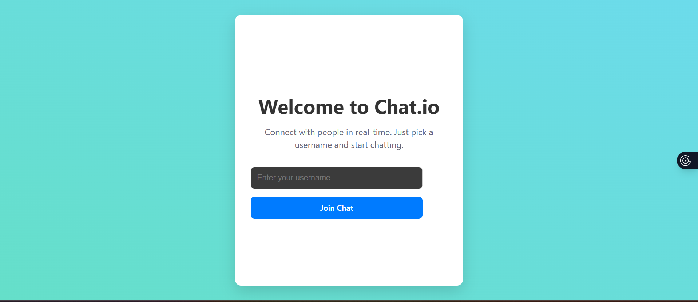
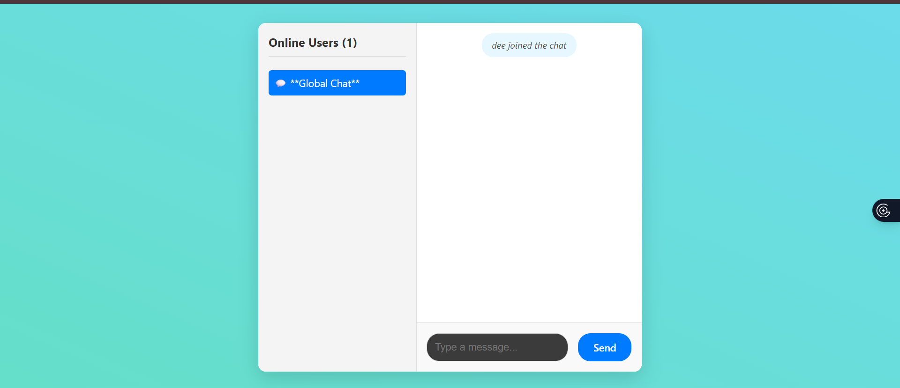

# Real-Time Chat Application with Socket.io

This project is a real-time chat application built for the Week 5 assignment. It uses a **Node.js/Express** server with **Socket.io** on the backend, and a **React (Vite)** application with a custom `useSocket` hook on the frontend.

The application features a polished landing page, a global chat room, a real-time online user list, private messaging, and a "user is typing" indicator. The design is fully responsive and works on both desktop and mobile devices.

## 📸 Screenshots

| Login Page | Chat Interface (Desktop) |
|  |  |

## ✨ Features Implemented

This project successfully fulfills the core requirements and several advanced features from the assignment.

### Core Features (Task 1 & 2)

  * **Project Setup:** Full setup with a Node.js/Express server and a React (Vite) client.
  * **Socket.io Connection:** A stable bidirectional connection is established between client and server.
  * **User Authentication:** A simple and clean username-based login (landing page).
  * **Global Chat:** All users join a "Global Chat" room by default upon connection.
  * **Live Messaging:** Messages are broadcast to all users in real-time.
  * **Online Status:** A sidebar displays a live list of all currently connected users.
  * **System Messages:** "User joined" and "User left" notifications are posted in the chat.

### Advanced Features (Task 3 & 5)

  * **1. Private Messaging:** Users can click on any name in the "Online Users" list to start a one-on-one private conversation. Messages are routed securely using Socket.io's `socket.to(id)` method.
  * **2. "User is Typing" Indicator:** A real-time typing indicator appears at the bottom of the chat when another user is composing a message, with debouncing to prevent flickering.
  * **3. Responsive UX (Task 5):** The application is fully responsive. On desktop, it features a modern, centered-card layout. On mobile, it transitions to a full-screen layout where the user list becomes a horizontal-scrolling component at the top.

## 🛠️ Setup and Installation

Follow these instructions to run the project locally.

### 1\. Clone the Repository

```bash
git clone https://github.com/PLP-MERN-Stack-Development/real-time-communication-with-socket-io-Deeja-ish.git
cd socketio-chat
```

### 2\. Set Up the Server

```bash
# Navigate to the server directory
cd server

# Install dependencies
npm install

# Create a .env file
touch .env

# Add the following to your .env file
# (Port 5173 is the default for Vite)
CLIENT_URL=http://localhost:5173
```

### 3\. Set Up the Client

```bash
# Navigate to the client directory
cd client

# Install dependencies
npm install

# Create a .env file
touch .env

# Add the following to your .env file
# (Port 5000 is our server port)
VITE_SOCKET_URL=http://localhost:5000
```

### 4\. Run the Application

You will need two separate terminals.

**In Terminal 1 (Server):**

```bash
# From the /server directory
npm run dev
```

> Server will be running on `http://localhost:5000`

**In Terminal 2 (Client):**

```bash
# From the /client directory
npm run dev
```

> Client will open automatically at `http://localhost:5173`

To test the chat, open a second browser window (e.g., an Incognito window) and log in with a different username.

## 📂 Project Structure

```
socketio-chat/
├── client/
│   ├── src/
│   │   ├── socket/
│   │   │   └── socket.js    # Custom useSocket hook
│   │   ├── App.css          # All application styles
│   │   └── App.jsx          # Main React component
│   └── .env                 # Client environment variables
├── server/
│   ├── .env                 # Server environment variables
│   └── server.js            # Main Express/Socket.io server
└── README.md                # This file
```

## 📚 Resources Used

  * [Socket.io Documentation](https://socket.io/docs/v4/)
  * [React Documentation](https://react.dev/)
  * [Express.js Documentation](https://expressjs.com/)